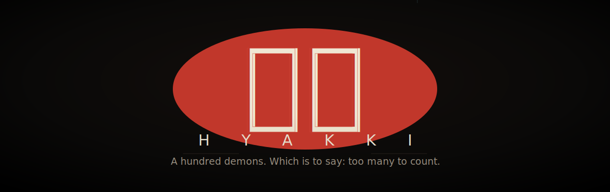
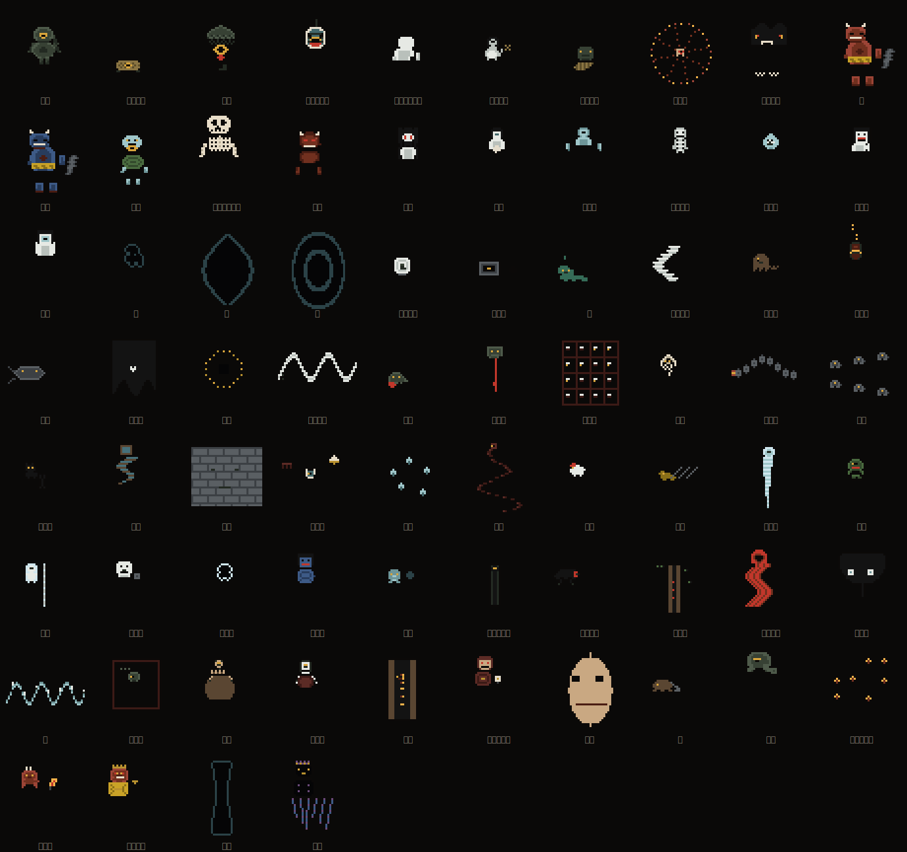
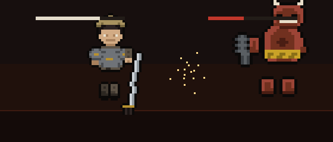
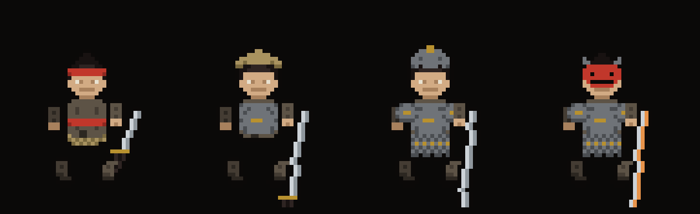
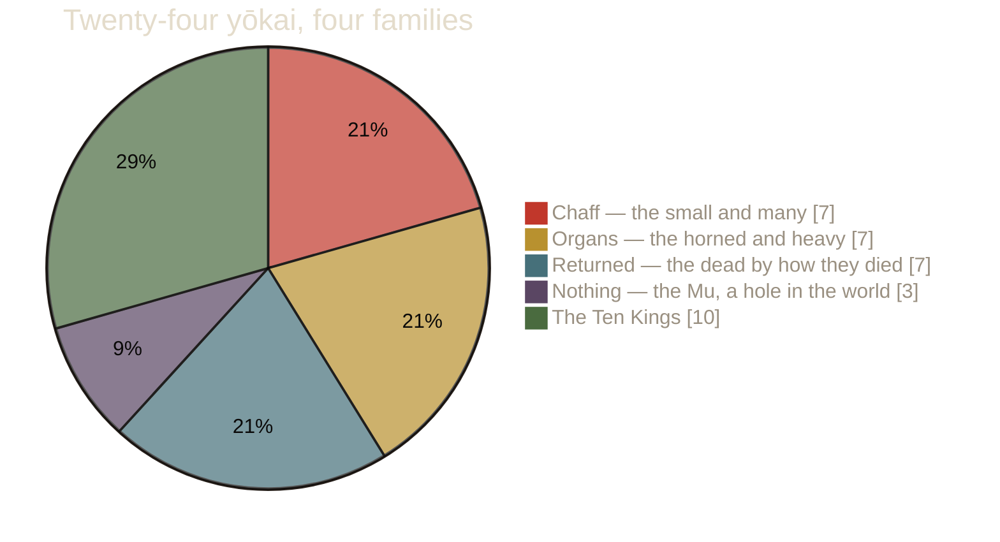
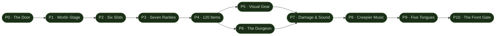

<div align="center">



<br/>

**An idle auto-battler descent through Japanese folklore — endless, procedural, and quietly horrifying.**
You march. You never stop. The Parade does not stop because you looked away.

<br/>


[](https://github.com/SenseiIssei/HYAKKI/releases/latest)
[](https://claude.ai/code/artifact/35e33d40-f417-4a79-915a-94c90d102493)

[](https://ko-fi.com/senseiissei)

</div>

---

## 百 What it is

**HYAKKI** (百鬼, *"a hundred demons"*) is a desktop idle game. You play a small soldier walking an endless road down through **Yomi**, the Japanese underworld — past the emptied village, across the river of three crossings, into the eight hot hells. Everything auto-battles. Your job is what you *become* between fights: what you learn, what you carry, and how far you're willing to defile yourself to go deeper.

It is built on a hard rule: **zero art and zero audio assets.** Every sprite is a hand-authored pixel grid. Every sound is Web Audio synthesis. Every drop of music is generated on a dark pentatonic scale. Even the app icon is made by a script. Nothing here was drawn by hand — it was all placed, pixel by pixel and partial by partial.

<div align="center">
<br/>

<br/>
<sub><i>All <b>twenty-four</b> yōkai — every one a real creature from the folklore, every one <b>animated</b>, each rendered straight from the game's own sprite engine into this image. No two share a silhouette; not one stands still.</i></sub>
</div>

---

## 鬼 The road, and the things on it

<table>
<tr>
<td width="50%" valign="top">

### The descent
- **Endless, procedural.** An infinite counter of Worlds and Stages, each seeded to be its own place.
- **Seven classes**, each defined by how it *produces* damage, not which stat is highest.
- **Wardens** — the **Ten Kings** of the courts of the dead, each a still, staring, one-of-ten sprite.
- **Kegare** 穢れ — defilement that buys power and sells back safety. A filthy walk hits harder and dies easier.
- **Ofuda** 御札 — four paper wards, chosen before a walk, each holding back one kind of thing.

</td>
<td width="50%" valign="top">

### The arts
- **Six auto-cast abilities** with cooldowns that **level and escalate** as you descend — a tier-1 flourish becomes a tier-3 catastrophe.
- **Iai · Hi-no-Kagura · Raijin · Kamaitachi · Meido-gaeshi · Hyakki-ō** — the sky comes down.
- **They actually fight.** The swing is shaped by the **weapon** — a light blade flurries, a heavy one winds up and slams — and every ability moves the whole body its own way. Each enemy family lunges, slams, jabs or drifts on its own attack, with **particles flying between the ranks**.
- **Flying damage numbers** that arc off the point of impact.
- **The Hundred Stories** — a Hyakumonogatari of 100 tales; read them and the room goes dark.

</td>
</tr>
</table>

<div align="center">
<br/>

<br/>
<sub><i>A soldier mid-swing against an oni — sprites, sparks, and HP bars all from the engine, no image files anywhere.</i></sub>
<br/><br/>

<br/>
<sub><i>The same soldier, deeper and deeper. Gear grows with power — and with what you actually equip.</i></sub>
</div>

---

## 算 By the numbers



| | |
|---|---:|
| Yōkai species (+ 10 Kings) | **24** |
| Auto-cast arts | **6** |
| Stories in the Hyakumonogatari | **100** |
| Playable classes | **7** |
| Equippable items (6 slots, 7 rarities) | **120** |
| Tests passing | **167** |
| Art & audio asset files | **0** |

---

## 界 Roadmap — *The Descent Rebuilt*

*The Descent Rebuilt* turned the idle walk into a full RPG: World-Stage levels, a hundred and twenty equippable items across six slots, dungeons that drop loot, gear that changes how the soldier looks, five languages, and a game-like front menu. Every phase below shipped and is playable.

**📜 Read the full design bible → [The Descent Rebuilt](https://claude.ai/code/artifact/35e33d40-f417-4a79-915a-94c90d102493)**

**All ten phases are shipped.** ✅



| | Phase | Delivered |
|:--:|---|---|
| ✅ | **The Door** | ✕ quits the app; minimize minimizes; the tray is opt-in |
| ✅ | **World–Stage** | `0-0, 0-1, 1-0…` infinite, each World procedurally themed |
| ✅ | **Six Slots** | Weapon · Body · Head · Hands · Legs · Charm, typed |
| ✅ | **Seven Rarities** | Issued → Kept → Named → Blessed → Cursed → Myth → True-Name |
| ✅ | **120 Items** | a full equippable catalogue with folklore lore |
| ✅ | **Visual Gear** | equipped gear drives the walker's actual sprite |
| ✅ | **The Dungeon** | delve with your loadout → depth-scaled tiered loot |
| ✅ | **Damage & Sound** | weapon classes, signature stats, per-weapon sfx |
| ✅ | **Creepier Music** | the score curdles as you descend |
| ✅ | **Five Tongues** | English · Deutsch · 日本語 · Français · Español |
| ✅ | **The Front Gate** | Continue / New Game / Enter Dungeon / Inventory / … |

---

## 戸 Build & run

```bash
# prerequisites: Node 18+, Rust (for the desktop build)
npm install

npm run dev      # play in the browser at localhost:5180
npm test         # run the 167-test suite (balance + compounding + content)
npm run build    # production web bundle

# desktop installer (Windows) → src-tauri/target/release/bundle/
npx @tauri-apps/cli@^1 build
```

The desktop shell is a real window with its own tray. **Closing it quits**; "Stop watching" drops it to the tray so the descent keeps running unwatched. The save is a real file at `%APPDATA%\dev.senseiissei.hyakki\` — not `localStorage`, which a browser wipe would eat.

---

## 窟 Under the hood

| Layer | What |
|---|---|
| **Sim** | A pure, headless simulation in `src/sim/` — never imports React. `break_infinity.js` from commit one, because every stat is exponential. |
| **Loop** | A wall-clock `setInterval` accumulator, **not** `requestAnimationFrame` — so the descent runs at full rate in a hidden window. |
| **Art** | `src/pixel/` — sprites as character grids composited from parts per frame. The parallax world is rasterised coarse and upscaled nearest-neighbour so it shares the sprite grid. |
| **Audio** | `src/audio/` — a generative score on the *in* scale (陰音階), a real cracked *bonshō*, per-region ambience, all synthesised. |
| **Shell** | Tauri v1 (Rust) — real file saves with rotating backups, a system tray, and generated icons. |

Stack: **React 18 · Vite · TypeScript (strict) · Zustand · Tauri v1**.

---

## 札 Support

HYAKKI is a solo project, built in the open. If the descent got its hooks in you, you can leave something in the tin:

<div align="center">

[](https://ko-fi.com/senseiissei)

</div>

---

<div align="center">
<sub>百鬼 <b>HYAKKI</b> · made by <a href="https://github.com/SenseiIssei">SenseiIssei</a> · nothing here was drawn by hand</sub>
</div>
